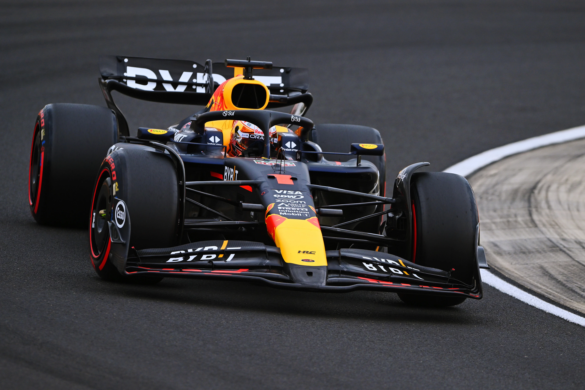

你好！这里是一个代码与赛车并轨飞驰的世界。

我是 **_King_**，一名计算机专业的大一学生，同时也是一个血液里流淌着汽油与二进制代码的F1狂热分子。

对我来说，计算机科学与F1赛车是同一枚硬币的两面：它们都是人类智慧在极限边界上的舞蹈。我痴迷于代码从逻辑到创造的魔法，也同样为赛道上毫秒间的策略博弈与空气动力学奇迹而心跳加速。

这个博客，就是我个人的 “数据记录仪” 和 “开发日志”。我会在这里：

* 「调试日志」：记录CS和大学学习生活中的“坑”与顿悟时刻，分享有价值的技术笔记。

* 「遥测分析」：解读F1赛场的技术风云、策略棋局与商业逻辑。

* 「架构前瞻」：探讨像AI、航天、消费电子等如何重塑我们生活的底层架构。

我不是专家，我是一个充满好奇的探索者。我相信，理解赛车如何过弯，能让我写出更高效的代码；理解芯片如何设计，也能让我更看懂车队的战略局限；理解星舰的设计思路，也能让我懂得如何挑战工程的极限。

我相信，编写优雅的代码与设计完美的赛车线路，追求的都是最优解；科技发布会与赛车进站，上演的都是精心编排的巅峰协作。我渴望探寻这些领域底层共通的逻辑与美感。

未来，希望这里能成为一个车库，一个实验室，也是我们这些好奇灵魂的维修区通道。

欢迎你，与我一同进入这个充满逻辑、速度与想象力的世界。系好安全带，我们的思维实验，现在发车。



**_我最喜欢的公式：麦克斯韦方程组_**

$$ \left\{\begin{matrix} \oint_{\partial V} \mathbf{E} \cdot d\mathbf{A} = \frac{Q_{\text{enc}}}{\varepsilon_0} \\ \oint_{\partial V} \mathbf{B} \cdot d\mathbf{A} = 0 \\ \oint_{\partial S} \mathbf{E} \cdot d\mathbf{l} = -\frac{d}{dt} \int_{S} \mathbf{B} \cdot d\mathbf{A} \\ \oint_{\partial S} \mathbf{B} \cdot d\mathbf{l} = \mu_0 \left( I_{\text{enc}} + \varepsilon_0 \frac{d}{dt} \int_{S} \mathbf{E} \cdot d\mathbf{A} \right)\end{matrix}\right. $$

$$ \left\{\begin{matrix} \nabla \cdot \mathbf{E} = \frac{\rho}{\varepsilon_0} \\ \nabla \cdot \mathbf{B} = 0 \\ \nabla \times \mathbf{E} = -\frac{\partial \mathbf{B}}{\partial t} \\ \nabla \times \mathbf{B} = \mu_0 \mathbf{J} + \mu_0 \varepsilon_0 \frac{\partial \mathbf{E}}{\partial t}\end{matrix}\right. $$

**_我最喜欢的算法：蒙特卡洛模拟_**
``` python
# 通用蒙特卡洛框架类
import random
import numpy as np
from typing import Callable, List, Tuple
import time
import statistics

class MonteCarloSimulator:
    """
    通用的蒙特卡洛模拟器类
    """
    
    def __init__(self, seed=None):
        """初始化模拟器"""
        if seed is not None:
            random.seed(seed)
            np.random.seed(seed)
    
    def estimate_value(self, 
                      sampler: Callable, 
                      evaluator: Callable, 
                      num_samples: int = 10000,
                      verbose: bool = False) -> Tuple[float, dict]:
        """
        通用的蒙特卡洛估值
        
        参数:
        sampler: 采样函数，每次调用返回一个样本
        evaluator: 评估函数，输入样本返回估值
        num_samples: 采样数量
        verbose: 是否显示详细过程
        
        返回:
        (估计值, 统计信息字典)
        """
        values = []
        start_time = time.time()
        
        for i in range(num_samples):
            sample = sampler()
            value = evaluator(sample)
            values.append(value)
            
            if verbose and i % (num_samples // 10) == 0 and i > 0:
                progress = i / num_samples * 100
                print(f"进度: {progress:.1f}%")
        
        estimate = sum(values) / num_samples
        
        # 计算统计信息
        stats = {
            'mean': estimate,
            'std': statistics.stdev(values) if len(values) > 1 else 0,
            'min': min(values),
            'max': max(values),
            'samples': num_samples,
            'time': time.time() - start_time,
            'values': values if len(values) <= 1000 else values[:1000]  # 保存部分值用于分析
        }
        
        # 计算标准误差和置信区间
        if len(values) > 1:
            std_error = stats['std'] / np.sqrt(num_samples)
            stats['std_error'] = std_error
            stats['confidence_95'] = (estimate - 1.96 * std_error, 
                                      estimate + 1.96 * std_error)
            stats['confidence_99'] = (estimate - 2.576 * std_error, 
                                      estimate + 2.576 * std_error)
        
        return estimate, stats
    
    def convergence_analysis(self, 
                           sampler: Callable, 
                           evaluator: Callable,
                           max_samples: int = 100000,
                           checkpoints: List[int] = None) -> dict:
        """
        收敛性分析：观察估计值如何随样本数增加而收敛
        
        返回包含不同样本数下结果的字典
        """
        if checkpoints is None:
            checkpoints = [100, 500, 1000, 5000, 10000, 50000, 100000]
            checkpoints = [c for c in checkpoints if c <= max_samples]
        
        results = {}
        
        print("进行收敛性分析...")
        for n in checkpoints:
            estimate, stats = self.estimate_value(sampler, evaluator, n)
            results[n] = {
                'estimate': estimate,
                'std_error': stats.get('std_error', 0)
            }
            print(f"  样本数 {n:7d}: 估计值 = {estimate:.6f} (±{stats.get('std_error', 0):.6f})")
        
        return results

# 使用示例
if __name__ == "__main__":
    print("=== 通用蒙特卡洛框架使用示例 ===")
    
    simulator = MonteCarloSimulator(seed=42)
    
    # 示例1：估算π值
    print("\n1. 估算π值:")
    
    def pi_sampler():
        return (random.random(), random.random())
    
    def pi_evaluator(point):
        x, y = point
        return 1 if x**2 + y**2 <= 1 else 0
    
    pi_estimate, pi_stats = simulator.estimate_value(pi_sampler, pi_evaluator, 100000)
    print(f"   估算结果: {4 * pi_estimate:.6f} (真实值: {np.pi:.6f})")
    print(f"   标准误差: {4 * pi_stats['std_error']:.6f}")
    print(f"   95%置信区间: ({4 * pi_stats['confidence_95'][0]:.6f}, "
          f"{4 * pi_stats['confidence_95'][1]:.6f})")
    
    # 示例2：估算复杂函数的积分
    print("\n2. 估算复杂积分 ∫(0到1) sin(x^2) dx:")
    
    def complex_sampler():
        return random.random()
    
    def complex_evaluator(x):
        return np.sin(x**2)
    
    integral_estimate, integral_stats = simulator.estimate_value(
        complex_sampler, complex_evaluator, 50000
    )
    print(f"   估算结果: {integral_estimate:.6f}")
    print(f"   标准误差: {integral_stats['std_error']:.6f}")
    
    # 收敛性分析
    print("\n3. 收敛性分析示例:")
    convergence_results = simulator.convergence_analysis(
        pi_sampler, pi_evaluator, max_samples=50000
    )

```


---

Hello! Welcome to a world where code and racing converge at full speed.

I’m **_King_**, a first-year computer science student and an F1 enthusiast whose veins run with gasoline and binary code.

To me, computer science and Formula 1 are two sides of the same coin—both are a dance of human intellect at the edge of possibility. I’m captivated by the magic that turns logic into creation through code, just as I’m thrilled by the split-second strategy and aerodynamic wonders on the racetrack.

This blog is my personal **data recorder** and **development log**. Here, I’ll share:

* **Debugging Notes**: Recording pitfalls and “aha!” moments in my CS journey and my college life, along with useful technical insights.
* **Telemetry Analysis**: Breaking down the tech, strategy, and business logic behind the scenes in F1.
* **Architecture Outlook**: Exploring how fields like AI, aerospace, and consumer electronics are reshaping the foundations of our world.

I’m not an expert—I’m a curious explorer. I believe understanding how a racing car takes a corner can help me write more efficient code; understanding how a chip is designed can deepen my view of a team’s strategic limits; and understanding the engineering behind Starship can inspire me to push boundaries.

To me, writing elegant code and designing the perfect racing line both seek the optimal solution; a tech keynote and a pit stop are both performances of meticulously orchestrated collaboration. I’m drawn to the underlying logic and beauty common across these fields.

I hope this space becomes a **garage**, a **lab**, and a **pit lane** for curious minds like ours.

Welcome. Strap in—our thought experiment is about to begin. 


**_My favourite formula: Maxwell's equations_**
$$ \left\{\begin{matrix} \oint_{\partial V} \mathbf{E} \cdot d\mathbf{A} = \frac{Q_{\text{enc}}}{\varepsilon_0} \\ \oint_{\partial V} \mathbf{B} \cdot d\mathbf{A} = 0 \\ \oint_{\partial S} \mathbf{E} \cdot d\mathbf{l} = -\frac{d}{dt} \int_{S} \mathbf{B} \cdot d\mathbf{A} \\ \oint_{\partial S} \mathbf{B} \cdot d\mathbf{l} = \mu_0 \left( I_{\text{enc}} + \varepsilon_0 \frac{d}{dt} \int_{S} \mathbf{E} \cdot d\mathbf{A} \right)\end{matrix}\right. $$

$$ \left\{\begin{matrix} \nabla \cdot \mathbf{E} = \frac{\rho}{\varepsilon_0} \\ \nabla \cdot \mathbf{B} = 0 \\ \nabla \times \mathbf{E} = -\frac{\partial \mathbf{B}}{\partial t} \\ \nabla \times \mathbf{B} = \mu_0 \mathbf{J} + \mu_0 \varepsilon_0 \frac{\partial \mathbf{E}}{\partial t}\end{matrix}\right. $$

**_My favourite algorithm: Monte Carlo Simulation_**

``` python
# General Monte Carlo Framework Class
import random
import numpy as np
from typing import Callable, List, Tuple
import time
import statistics

class MonteCarloSimulator:
    """
    General Monte Carlo simulator class
    """
    
    def __init__(self, seed=None):
        """Initialize simulator"""
        if seed is not None:
            random.seed(seed)
            np.random.seed(seed)
    
    def estimate_value(self, 
                      sampler: Callable, 
                      evaluator: Callable, 
                      num_samples: int = 10000,
                      verbose: bool = False) -> Tuple[float, dict]:
        """
        General Monte Carlo value estimation
        
        Parameters:
        sampler: Sampling function, returns one sample per call
        evaluator: Evaluation function, returns value for given sample
        num_samples: Number of samples
        verbose: Whether to show detailed process
        
        Returns:
        (Estimated value, Statistics dictionary)
        """
        values = []
        start_time = time.time()
        
        for i in range(num_samples):
            sample = sampler()
            value = evaluator(sample)
            values.append(value)
            
            if verbose and i % (num_samples // 10) == 0 and i > 0:
                progress = i / num_samples * 100
                print(f"Progress: {progress:.1f}%")
        
        estimate = sum(values) / num_samples
        
        # Calculate statistics
        stats = {
            'mean': estimate,
            'std': statistics.stdev(values) if len(values) > 1 else 0,
            'min': min(values),
            'max': max(values),
            'samples': num_samples,
            'time': time.time() - start_time,
            'values': values if len(values) <= 1000 else values[:1000]  # Save partial values for analysis
        }
        
        # Calculate standard error and confidence intervals
        if len(values) > 1:
            std_error = stats['std'] / np.sqrt(num_samples)
            stats['std_error'] = std_error
            stats['confidence_95'] = (estimate - 1.96 * std_error, 
                                      estimate + 1.96 * std_error)
            stats['confidence_99'] = (estimate - 2.576 * std_error, 
                                      estimate + 2.576 * std_error)
        
        return estimate, stats
    
    def convergence_analysis(self, 
                           sampler: Callable, 
                           evaluator: Callable,
                           max_samples: int = 100000,
                           checkpoints: List[int] = None) -> dict:
        """
        Convergence analysis: Observe how estimate converges with increasing samples
        
        Returns dictionary with results at different sample sizes
        """
        if checkpoints is None:
            checkpoints = [100, 500, 1000, 5000, 10000, 50000, 100000]
            checkpoints = [c for c in checkpoints if c <= max_samples]
        
        results = {}
        
        print("Performing convergence analysis...")
        for n in checkpoints:
            estimate, stats = self.estimate_value(sampler, evaluator, n)
            results[n] = {
                'estimate': estimate,
                'std_error': stats.get('std_error', 0)
            }
            print(f"  Samples {n:7d}: Estimate = {estimate:.6f} (±{stats.get('std_error', 0):.6f})")
        
        return results

# Usage example
if __name__ == "__main__":
    print("=== General Monte Carlo Framework Example ===")
    
    simulator = MonteCarloSimulator(seed=42)
    
    # Example 1: Estimate π
    print("\n1. Estimating π:")
    
    def pi_sampler():
        return (random.random(), random.random())
    
    def pi_evaluator(point):
        x, y = point
        return 1 if x**2 + y**2 <= 1 else 0
    
    pi_estimate, pi_stats = simulator.estimate_value(pi_sampler, pi_evaluator, 100000)
    print(f"   Estimate: {4 * pi_estimate:.6f} (Actual: {np.pi:.6f})")
    print(f"   Standard Error: {4 * pi_stats['std_error']:.6f}")
    print(f"   95% Confidence Interval: ({4 * pi_stats['confidence_95'][0]:.6f}, "
          f"{4 * pi_stats['confidence_95'][1]:.6f})")
    
    # Example 2: Estimate complex function integral
    print("\n2. Estimating complex integral ∫(0 to 1) sin(x²) dx:")
    
    def complex_sampler():
        return random.random()
    
    def complex_evaluator(x):
        return np.sin(x**2)
    
    integral_estimate, integral_stats = simulator.estimate_value(
        complex_sampler, complex_evaluator, 50000
    )
    print(f"   Estimate: {integral_estimate:.6f}")
    print(f"   Standard Error: {integral_stats['std_error']:.6f}")
    
    # Convergence analysis
    print("\n3. Convergence Analysis Example:")
    convergence_results = simulator.convergence_analysis(
        pi_sampler, pi_evaluator, max_samples=50000
    )
```
